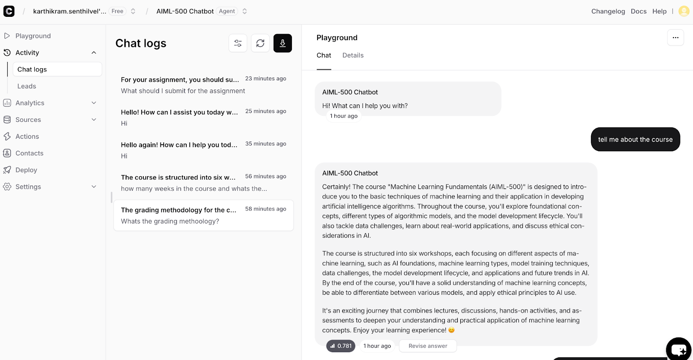
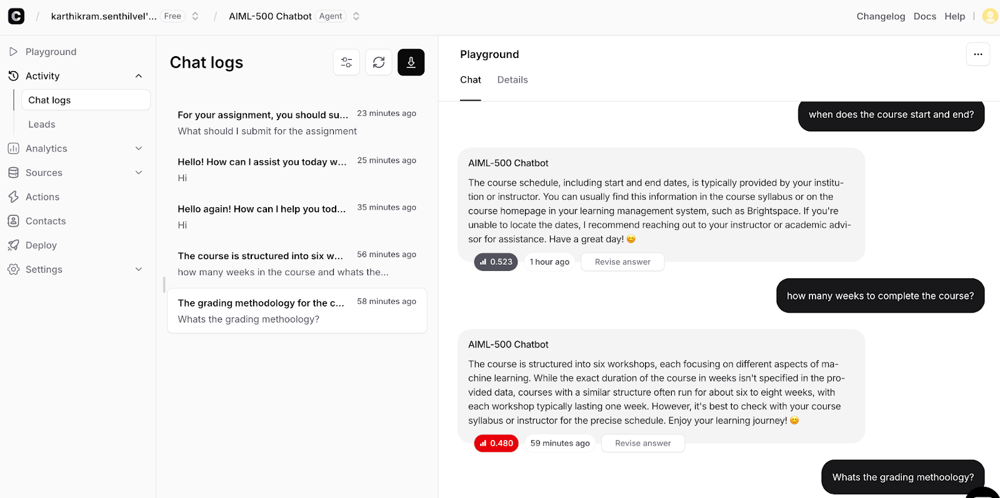
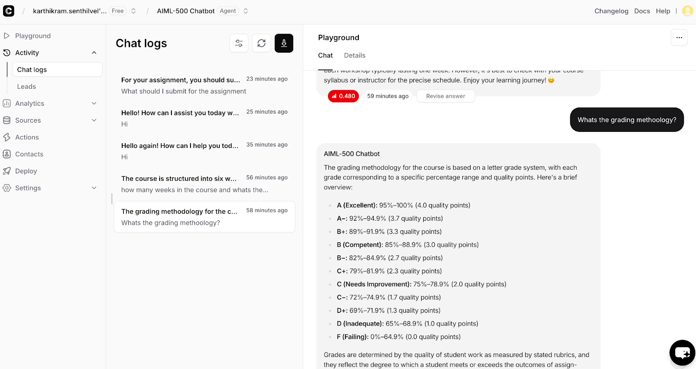

# My First AI Lab Walkthrough

This artifact is a short, 'how-to' blog post that details the steps I took to complete the AI Lab. It is designed to be a practical resource for anyone new to the lab environment, showcasing not just the final result but the learning journey itself.

## Objective

The primary objective of creating this artifact was to solidify my own learning by "teaching" the process to others. It also serves to create a tangible piece of evidence for my portfolio that demonstrates my ability to learn new technical systems, follow complex instructions, and clearly communicate my process to a target audience.

## Process

To create this artifact, I followed these steps:

1.  While completing the AI Lab, I took detailed notes and screenshots of each key step and interaction.
2.  I identified the most critical or challenging parts of the lab to highlight for a new user.
3.  I structured these notes and screenshots into a logical, step-by-step guide.
4.  I wrote descriptive text to accompany each step, explaining what I was doing and why.

## Tools and Technologies Used

* **Google Sites:** The platform used to build and publish this portfolio artifact.
* **chatbase.co:** The core environment where the work was completed.
* **Screen-Capture Tool:** Used to generate the visual evidence (screenshots) for the guide.

## Screenshots

---

* [Back to Projects](./projects)
* [Back to Home](./)
