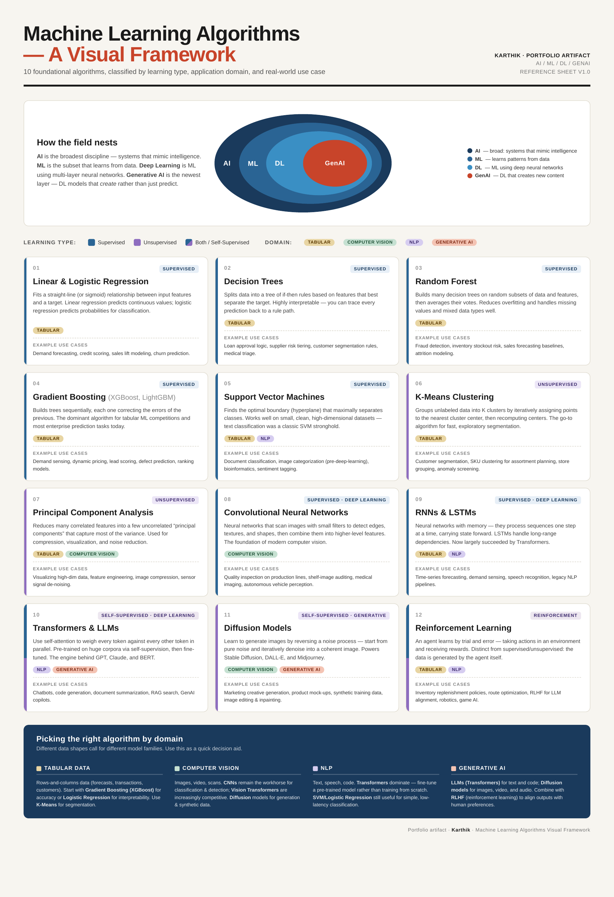

# Machine Learning Algorithms — A Visual Framework

This artifact is a one-page visual reference that classifies 12 foundational machine learning algorithms by learning type and application domain, with brief explanations and real-world use cases for each. It is designed to serve as a working reference throughout my AI/ML coursework and professional development.

## Objective

To consolidate the landscape of modern ML algorithms — spanning classical ML, deep learning, and generative AI — into a single visual framework that makes it easy to answer two practical questions: *(1) Where does this algorithm fit in the AI / ML / DL / GenAI hierarchy?* and *(2) Which algorithm should I reach for given the data shape (tabular, vision, text, generative)?*

## Process

To create this artifact, I followed these steps:

1. **Reviewed the foundational distinctions** between AI, ML, Deep Learning, and Generative AI to establish the nested hierarchy that anchors the framework.
2. **Selected 12 algorithms** covering the supervised / unsupervised / self-supervised / reinforcement learning spectrum, balancing classical methods (Linear Regression, Decision Trees, K-Means, PCA) with modern deep learning (CNNs, Transformers, Diffusion Models).
3. **Classified each algorithm** by learning type, applicable domain(s) (Tabular, Computer Vision, NLP, Generative AI), and grounded each one with concrete real-world use cases — drawing on supply chain and analytics examples I work with day-to-day.
4. **Designed the visual layout** with consistent color coding: blue for supervised, purple for unsupervised, and color-coded domain pills so the framework can be scanned at a glance.
5. **Added a domain-based decision guide** at the bottom translating "what kind of data do I have?" into "which algorithm family should I start with?"

## Reflection

Building this framework forced me to step back from individual algorithms I use day-to-day in supply chain work — gradient boosting for demand forecasting, K-Means for SKU clustering — and see them as part of a single learning-type-by-domain landscape. The biggest insight: algorithm choice is dictated more by data shape than by problem novelty. Tabular problems still belong to XGBoost; vision belongs to CNNs and increasingly diffusion; language belongs to Transformers. GenAI didn't replace classical ML — it stacked on top of deep learning. I plan to extend this artifact later with a second view showing where each algorithm sits on the interpretability ↔ accuracy tradeoff, and a supply-chain-specific overlay mapping algorithms to planning use cases.

## Artifact

📄 **[Download the full PDF](assets/ML_Algorithms_Visual_Framework.pdf)**
