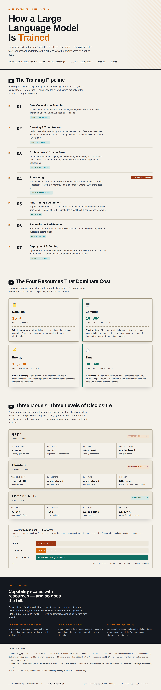

# How a Large Language Model Is Trained

This artifact is a visual infographic that explains how generative AI large language models are trained — walking through the full pipeline from data collection to deployment, the four resources that dominate training cost, and a grounded comparison of three real frontier models (GPT-4, Claude, and Llama 3.1 405B).

## Objective

To translate a technically dense topic — the process and economics of training generative AI LLMs — into a single, accessible visual that a non-specialist audience can follow. The infographic answers two questions: *(1) What are the key steps in training an LLM, from initial data collection through deployment?* and *(2) What resources — datasets, compute, energy, and time — does that process consume, and what does it cost in practice?*

## Process

To create this artifact, I followed these steps:

1. **Researched the training pipeline** and broke it into seven sequential stages (data collection → cleaning/tokenization → architecture & cluster setup → pretraining → fine-tuning/alignment → evaluation & red-teaming → deployment), identifying pretraining as the dominant cost center.
2. **Defined the four resource pillars** — datasets, compute, energy, and time — and attached a concrete published figure and a "why it matters" rationale to each.
3. **Sourced real numbers for three flagship models.** Meta publishes full figures for Llama 3.1 405B (30.84M GPU-hours, 16,384 H100 GPUs, 15T+ tokens, 11,390 t CO₂e). For GPT-4 and Claude, I used the only figures the labs have made public — Sam Altman's "more than $100M" for GPT-4, and reported "tens of millions" for Claude 3.5 — and explicitly labeled everything else as estimated.
4. **Designed the visual** as a self-contained, responsive HTML page using an editorial "engineering dossier" aesthetic (IBM Plex typography, ink-on-paper palette, monospace data labels) so it reads as a credible technical reference rather than a generic slide.
5. **Built in honesty about uncertainty** — a disclosure badge on each model and a dedicated takeaway panel make the transparency gap between open-weight and closed labs part of the story, not a footnote.

## Tools and Technologies Used

* **HTML5 / CSS3:** Hand-built the infographic as a single responsive page, designed to be served directly on GitHub Pages.
* **Playwright (headless Chromium):** Rendered a high-resolution PNG preview so the artifact displays inline on the portfolio.
* **Web research:** Verified all figures against primary sources (Meta/Hugging Face model card) and reputable secondary reporting for the estimated values.

## Reflection

The hardest part of this artifact was not the design — it was the data integrity. I started out wanting a clean side-by-side cost comparison of GPT-4, Claude, and Llama, and quickly discovered that only Meta publishes complete numbers. OpenAI and Anthropic disclose a single headline figure at most. Rather than fabricate a tidy chart, I made that gap the central message: every estimated value is labeled, and a disclosure badge tells the viewer exactly how much to trust each row.

That decision connects directly to how I work in supply chain analytics. A comparison that looks authoritative but quietly mixes audited figures with guesses is worse than no comparison at all — it gives stakeholders false confidence. The discipline of separating what is *measured* from what is *modeled*, and labeling each, is the same whether the subject is GPU-hours or forecast accuracy. Building this infographic reinforced that good data visualization isn't about making numbers look impressive; it's about making their reliability legible.

## Presentation

* **[View the interactive infographic](./assets/llm-training-infographic.html)** (renders as a live web page)
* **[Explanatory document](./assets/llm-training-explanatory-document.md)** — summary, key considerations, and design rationale
